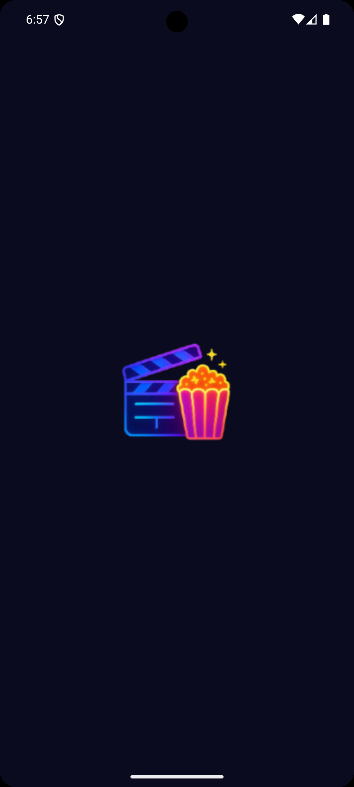
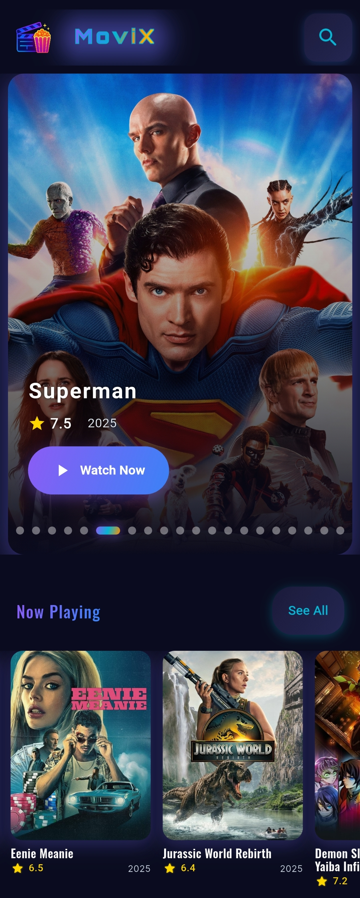
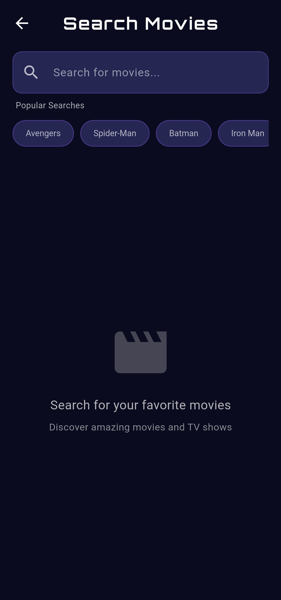
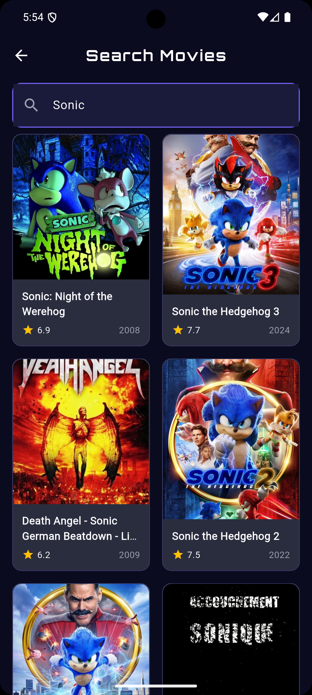
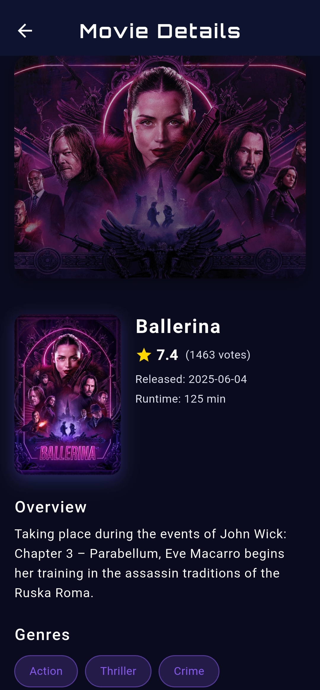
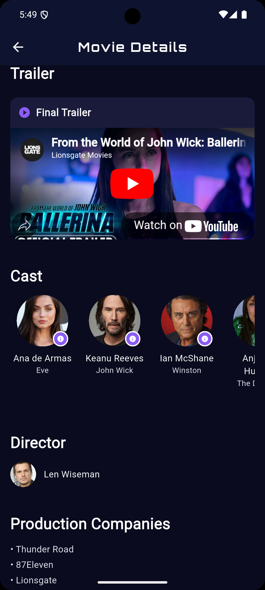
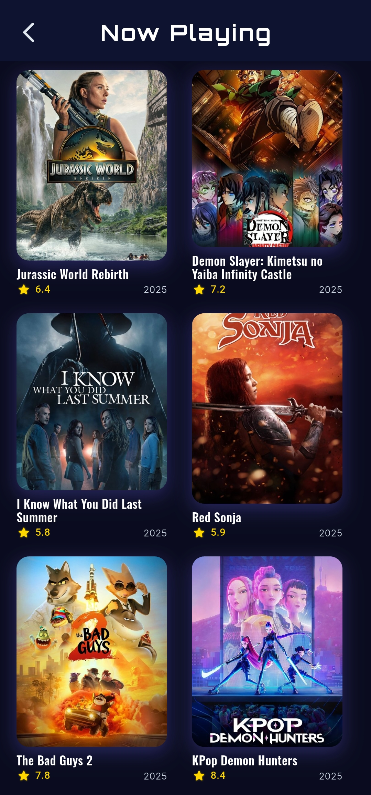
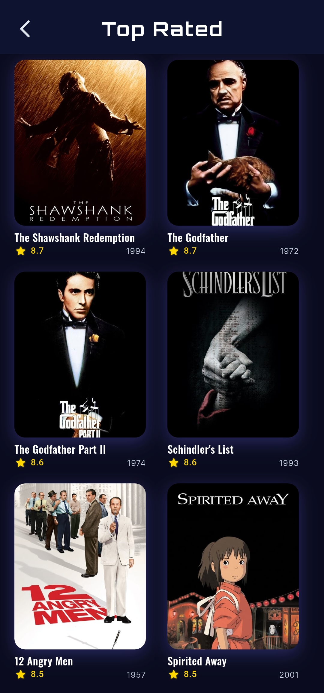
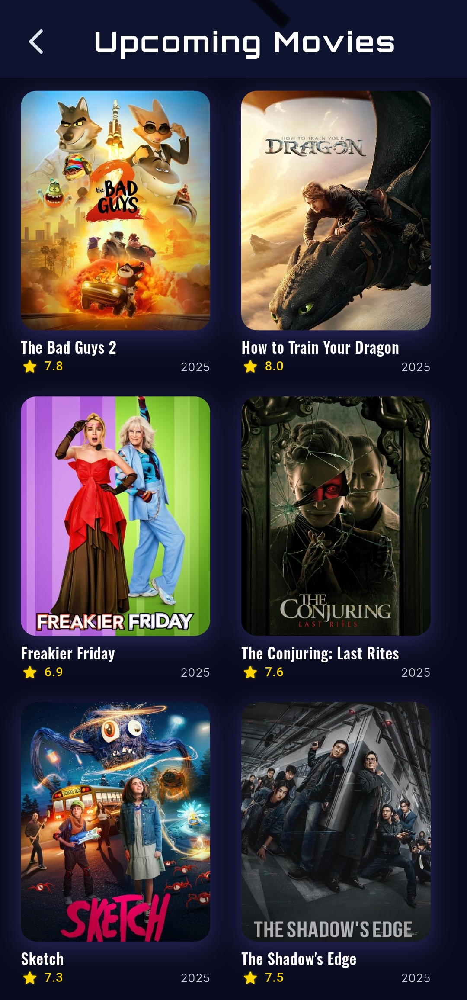

# 🎬 MoviX - Cinema Neon Experience

<div align="center">


**Discover movies like never before with our sleek, neon-inspired cinema app!**

</div>

---

## 📱 App Screenshots

### 🌟 Main Screens

| 🌟 Splash Screen | 🏠 Home Screen | 🔍 Search Screen |
|:---:|:---:|:---:|
|  |  |  |

### 🔍 Search & Movie Details  

| 🔍 Search Results | 🎭 Movie Details | 🎬 Cast & Crew |
|:---:|:---:|:---:|
|  |  |  |

### 🎬 Movie Categories

| 🎬 Now Playing | ⭐ Top Rated | 🔮 Upcoming |
|:---:|:---:|:---:|
|  |  |  |

---

## 🏗️ Clean Architecture

MoviX follows **Clean Architecture** principles with **MVVM pattern** for maintainable and scalable code:

```
📁 lib/
├── 🎨 presentation/           # UI Layer
│   ├── screens/              # App Screens
│   ├── controllers/          # State Management (GetX)
│   └── widgets/              # Reusable UI Components
├── 🏢 domain/                # Business Logic Layer  
│   ├── entities/             # Core Business Models
│   ├── repositories/         # Abstract Repository Interfaces
│   └── usecases/             # Business Use Cases
├── 🗃️ data/                  # Data Layer
│   ├── repositories/         # Repository Implementations
│   ├── datasources/          # Remote & Local Data Sources
│   └── models/               # Data Transfer Objects
└── ⚙️ core/                   # Shared Components
    ├── bindings/             # Dependency Injection
    ├── constants/            # App Constants
    ├── network/              # Network Configuration
    └── utils/                # Helper Functions
```

---

## 🛠️ Tech Stack

### 📦 Core Dependencies

| Package | Version | Purpose |
|---------|---------|---------|
| 🎯 **flutter** | 3.9.0 | Cross-platform framework |
| 🎯 **dart** | 3.9.0 | Programming language |
| ⚡ **get** | 4.6.6 | State management & routing |
| 🌐 **http** | 1.1.0 | HTTP client for API calls |
| 🖼️ **cached_network_image** | 3.3.1 | Efficient image caching |
| ✨ **shimmer** | 3.0.0 | Loading animations |
| 🎨 **google_fonts** | 6.1.0 | Beautiful typography |
| 💾 **shared_preferences** | 2.2.2 | Local data storage |
| 🔗 **url_launcher** | 6.2.4 | External URL handling |
| 🌊 **flutter_native_splash** | 2.3.10 | Native splash screens |

---

## 🎨 Cinema Neon Color Palette

<div align="center">

| Color Name | Hex Code | Preview | Usage |
|:----------:|:--------:|:-------:|:-----:|
| **Neon Purple** | `#8B5CF6` |  | Primary buttons, highlights |
| **Electric Cyan** | `#06B6D4` |  | Secondary accents, links |
| **Neon Orange** | `#FF8C00` |  | Rating stars, warnings |
| **Electric Gold** | `#FFD700` |  | Premium features, success |
| **Deep Blue** | `#3B82F6` |  | Navigation, categories |
| **Dark Background** | `#0F172A` |  | Main background |

</div>

---

## 🚀 Features

### ✨ Core Features
- 🎬 **Movie Discovery**: Browse trending, popular, and upcoming movies
- 🔍 **Smart Search**: Find movies instantly with advanced search
- 📋 **Detailed Info**: Cast, crew, ratings, and plot summaries  
- 🎭 **Actor Profiles**: Explore filmographies and biographies
- ⭐ **Ratings & Reviews**: See what others think about movies
- 📱 **Responsive Design**: Works perfectly on all screen sizes

### 🎨 Design Features  
- 🌈 **Neon Theme**: Eye-catching cinema-inspired design
- ✨ **Smooth Animations**: Fluid transitions and loading effects
- 🖼️ **Smart Caching**: Fast image loading with offline support
- 🎯 **Clean UI/UX**: Intuitive and user-friendly interface

---

## 🔧 Installation

### Prerequisites
- Flutter SDK (3.9.0+)
- Dart SDK (3.9.0+)
- Android Studio / VS Code
- Android SDK / Xcode

### Setup Steps

1. **Clone the repository**
   ```bash
   git clone https://github.com/yourusername/movix-app.git
   cd movix-app
   ```

2. **Install dependencies**
   ```bash
   flutter pub get
   ```

3. **API Configuration**
   - Get your API key from [TMDB](https://www.themoviedb.org/settings/api)
   - Create `lib/core/constants/api_constants.dart`:
   ```dart
   class ApiConstants {
     static const String apiKey = 'YOUR_API_KEY_HERE';
     static const String baseUrl = 'https://api.themoviedb.org/3';
     static const String imageBaseUrl = 'https://image.tmdb.org/t/p/w500';
   }
   ```

4. **Run the app**
   ```bash
   flutter run
   ```

---

## 🌐 API Integration

This app uses **The Movie Database (TMDB) API** for all movie data:

- **Base URL**: `https://api.themoviedb.org/3`
- **Image URL**: `https://image.tmdb.org/t/p/w500`
- **Documentation**: [TMDB API Docs](https://developer.themoviedb.org/docs)

### Key Endpoints:
- `/movie/popular` - Popular movies
- `/movie/top_rated` - Top rated movies  
- `/movie/upcoming` - Upcoming movies
- `/movie/now_playing` - Now playing movies
- `/search/movie` - Search movies
- `/movie/{id}` - Movie details

---

## 📁 Project Structure

```
movix/
├── android/              # Android-specific files
├── ios/                  # iOS-specific files  
├── lib/
│   ├── main.dart         # App entry point
│   ├── core/             # Core functionality
│   ├── data/             # Data layer
│   ├── domain/           # Domain layer
│   └── presentation/     # UI layer
├── assets/
│   └── images/           # App icons and images
├── screenshot/           # App screenshots
├── test/                 # Unit tests
└── pubspec.yaml          # Dependencies
```

---

## 🤝 Contributing

We welcome contributions! Please follow these steps:

1. Fork the repository
2. Create a feature branch (`git checkout -b feature/amazing-feature`)
3. Commit your changes (`git commit -m 'Add amazing feature'`)
4. Push to the branch (`git push origin feature/amazing-feature`)
5. Open a Pull Request

---

## 📄 License

This project is licensed under the MIT License - see the [LICENSE](LICENSE) file for details.

---

## 👨‍💻 Author

**Your Name**
- GitHub: [@yourusername](https://github.com/yourusername)
- LinkedIn: [Your LinkedIn](https://linkedin.com/in/yourprofile)
- Email: your.email@example.com

---

<div align="center">

### 🌟 If you like this project, please give it a ⭐!

**Made with ❤️ and Flutter**

</div>
